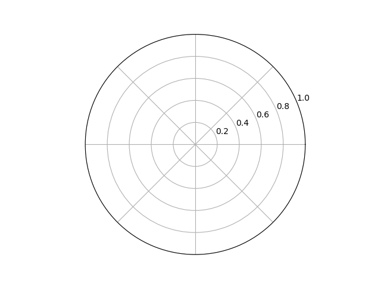

#  SHAREing: High-level performance assessment report

> [!NOTE]
>
> 1. Guidance throughout this template is provided using information boxes, along with example text and placeholders. The example text is not meant to be a complete comment, but a suggestion to get you started. Please remove the information boxes and replace the example text in your report.
>
> 2. The template is based on Chapter 5 of the [performance assessment guidebook](https://shareing-dri.github.io/performance-assessment/guidebook).
>
> 3. This template is not exhaustive, but should provide the framework for completing a high-level assessment using the information submitted via the [assessment submission form](https://forms.office.com/Pages/ResponsePage.aspx?id=i9hQcmhLKUW-RNWaLYpvlIUXnqx3D81Bt-KemxGOyY5UOU9RQkFSOE5UU1Y1QVZNS0QyNlFYNjRNOS4u), by the submitter.

## Table of Contents

1. [Setup Details](#setup-details)
2. [Executive Summary](#executive-summary)
3. [CPU Assessment](#cpu-assessment)
4. [GPU Assessment](#gpu-assessment)
5. [IO Assessment](#io-assessment)
6. [Intra-node Assessment](#intra-node-assessment)
7. [Inter-node Assessment](#inter-node-assessment)

## Setup Details
* Program: 
* Parallel model: 
* Dependencies: 
* Compiler: 
* Compiler flags: 
* Problem spec: 

## Executive Summary

The following table collates the results of all below assessments. These scores are indicative only, and cannot truly be compared to one another meaningfully without taking into account domain knowledge and methodological differences between them.

| Result | Score | Metric result |
| ---------------------- | - | - |
| CPU                    |   |   |
| GPU                    |   |   |
| IO                     |   |   |
| Intra-node 80% (60%)   |   |   |
| Inter-node 80% (60%)   |   |   |

> [!IMPORTANT]
>
> Here the assessor should interpret the scores to provide a recommendation for which rubrics may merit further investigation in intermediate or lower level assessments.
> An example of such a paragraph is included:
>
> In summary, we find no concerns with IO and CPU usage, with both above our 80% threshold.
> The rapid drop in intra-node efficiency with a fall below the efficiency thresholds at 4 threads out of our testing range of 128 threads indicate a region where further study may be useful, especially since the system we tested on has its smallest non-uniform memory access (NUMA) domains being 4 cores in size.
> Normally, we would expect that parallel efficiency would fall once the thread count exceeds the smallest NUMA domain due to hardware limitations, so it is likely there is actions we could take to improve the efficiency.



## CPU Assessment
For a basic high-level assessment of CPU performance, we look for the floating-point operation rate compared to the theoretical rate for the CPU.

The hardware capabilities were determined with
```bash
$ 
```

The software CPU compute rate was determined with
```bash
$ 
```

|    | MFLOP/s | 
| -------- | - |
| CPU      |   |
| Measured |   |

We determine this software to have a CPU score of `X`.

> [!IMPORTANT]
>
> Here the assessor should add context and interpretation to the score to help the code owner understand what the assessment result means.
> An example of such a paragraph is below:
>
> We determine this software to have a CPU score of 88%. Based on this, we expect there to be limited to no prospect for increases in performance based on CPU specific optimisations.

## GPU Assessment
For a basic high-level assessment of GPU performance, we look for the average occupancy of the GPU floating-point modules.

The theoretical GPU compute rate is `X MFLOPS/s`.

The software GPU compute rate was determined with
```shell
$ 
```

|    | MFLOP/s |
| -------- | - |
| GPU      |   |
| Measured |   |

We determine this software to have a GPU score of `X`.

> [!IMPORTANT]
>
> Here the assessor should add context and interpretation to the score to help the code owner understand what the assessment result means.
> An example of such a paragraph is below:

## IO Assessment
For a basic high-level assessment of IO performance, we look for the proportion of the runtime spent processing IO requests.

The IO time was determined with
```shell
$ 
```

The IO utilisation ratio is `X`, and the IO score is `1-X`.

> [!IMPORTANT]
>
> Here the assessor should add context and interpretation to the score to help the code owner understand what the assessment result means.
> An example of such a paragraph is below:

## Intra-node Assessment
For a basic high-level assessment of intra-node performance, we perform a strong scaling by fixing the problem size and increasing core allocation.

For this code, we tested with core counts in powers of 2 from 1 to 64.

| Thread count | Time (s) | Parallel Efficiency |
| -- | - | - |
|  1 |   |   |
|  2 |   |   |
|  4 |   |   |
|  8 |   |   |
| 16 |   |   |
| 32 |   |   |
| 64 |   |   |

Hence, our 80% threshold is at `X` cores and our 60% threshold is at `Y` cores. As a proportion of the number of cores available, which is `Z` on the node this was run on, this gives a score of `X/Z` and `Y/Z`.


> [!IMPORTANT]
>
> Here the assessor should add context and interpretation to the score to help the code owner understand what the assessment result means.
> An example of such a paragraph is below:

## Inter-node Assessment
For a basic high-level assessment of inter-node performance, we perform a weak scaling by increasing problem size linearly with node allocation.

> [!IMPORTANT]
>
> Here the assessor should add context and interpretation to the score to help the code owner understand what the assessment result means.
> An example of such a paragraph is below: